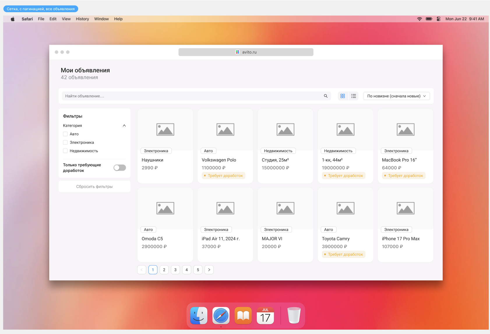
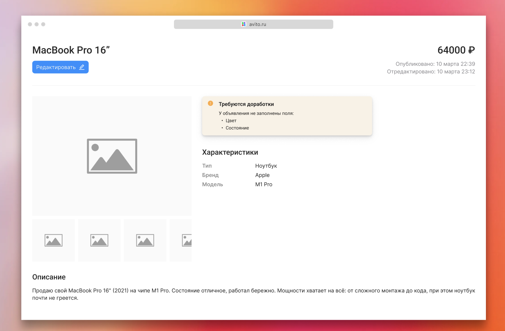
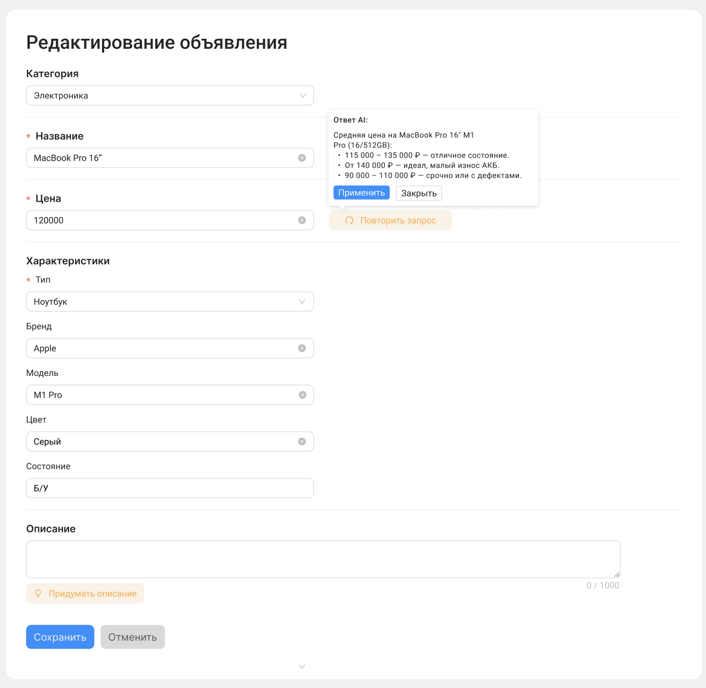

# Тестовое задание для стажёра Frontend (весенняя волна 2026)

## AI-ассистент для улучшения объявлений на Авито

### Описание задачи

Необходимо разработать веб-приложение - личный кабинет продавца с интегрированным AI-ассистентом, который помогает улучшать описания объявлений. Продавец видит список своих объявлений, выбирает нужное и может просмотреть карточку товара, перейти к редактированию и запросить рекомендации от нейросети. Сервис анализирует содержимое карточки товара и предлагает улучшения текста.

Макеты интерфейса доступны по [ссылка на Figma](https://www.figma.com/design/mkeo1cvzQpEqmN3txeDNBo/%D0%9C%D0%B0%D0%BA%D0%B5%D1%82-%D1%82%D0%B5%D1%81%D1%82%D0%BE%D0%B2%D0%BE%D0%B3%D0%BE-%D0%B7%D0%B0%D0%B4%D0%B0%D0%BD%D0%B8%D1%8F-%D1%81%D1%82%D0%B0%D0%B6%D1%91%D1%80%D0%B0%D0%BC?node-id=16-1388&p=f&t=outUVTh9O2CIiDpq-0).
- [List view](https://www.figma.com/design/mkeo1cvzQpEqmN3txeDNBo/%D0%9C%D0%B0%D0%BA%D0%B5%D1%82-%D1%82%D0%B5%D1%81%D1%82%D0%BE%D0%B2%D0%BE%D0%B3%D0%BE-%D0%B7%D0%B0%D0%B4%D0%B0%D0%BD%D0%B8%D1%8F-%D1%81%D1%82%D0%B0%D0%B6%D1%91%D1%80%D0%B0%D0%BC?node-id=20-1229)
- [Item view](https://www.figma.com/design/mkeo1cvzQpEqmN3txeDNBo/%D0%9C%D0%B0%D0%BA%D0%B5%D1%82-%D1%82%D0%B5%D1%81%D1%82%D0%BE%D0%B2%D0%BE%D0%B3%D0%BE-%D0%B7%D0%B0%D0%B4%D0%B0%D0%BD%D0%B8%D1%8F-%D1%81%D1%82%D0%B0%D0%B6%D1%91%D1%80%D0%B0%D0%BC?node-id=23-2515)

### Бизнес-контекст

Качество описания объявления напрямую влияет на скорость продажи: чем подробнее и привлекательнее текст, тем больше откликов получает продавец. Большинство пользователей Авито не являются профессиональными копирайтерами и зачастую публикуют краткие или неинформативные описания. AI-ассистент помогает продавцу быстро получить конкретные рекомендации и улучшить своё объявление без лишних усилий.

---

### Технические требования

#### Обязательные:
- Node.js v20+
- React v18+
- `react-router-dom` для роутинга
- TypeScript
- Использование предоставленного backend API (поднимается через Docker Compose, инструкция ниже)
- Самостоятельная интеграция с LLM API для AI-функций (варианты: локально через Ollama или через внешний API - инструкция ниже)
- Исходный код выложен на публичный git-репозиторий (GitHub / Gitverse) с README-файлом, содержащим инструкцию по запуску

#### Инструментарий:
- Использование любой UI-библиотеки (Material-UI, Ant Design, Mantine и другие)
- Стейт-менеджмент (Zustand, Redux, MobX, Effector)
- Линтер (ESLint) и форматтер (Prettier)
- Система сборки (Webpack или Vite - на ваш выбор)
- Библиотека для HTTP-запросов (React Query / TanStack Query, Axios)

#### Дополнительные (со звёздочкой):
- Возможность запустить клиент и сервер через `docker compose`
- Прерывание (отмена) запросов при переходе между страницами
- Покрытие кода юнит-тестами

> Использование AI-инструментов при разработке разрешено, однако на следующих этапах отбора вас могут попросить объяснить любой фрагмент написанного кода.

---

### Функциональные требования

Приложение состоит из 4 страниц (3 уникальных):

> Отображение состояния загрузки данных и отображение ошибок является неотъемлемой частью каждой страницы

#### 1. Страница списка объявлений (`/ads`)



Отображение всех объявлений продавца.

**Шапка страницы:**
- Заголовок «Мои объявления» с общим количеством объявлений
- Строка поиска по названию объявления
- Сортировка (например, по новизне, по цене)

**Каждая карточка содержит:**
- Изображение товара (или placeholder)
- Категорию (Авто, Электроника, Недвижимость)
- Название объявления
- Цену
- Бейдж «Требует доработок» - если у объявления есть незаполненные поля

**Фильтры (боковая панель):**
- Фильтрация по категории: Авто, Электроника, Недвижимость
- Переключатель «Только требующие доработок»
- Кнопка «Сбросить фильтры»

**Пагинация:**
- По 10 объявлений на страницу
- Навигация между страницами (с кнопками «вперёд» / «назад»)

**Действия:**
- При клике на карточку - переход на страницу просмотра объявления

**Необязательный функционал**
- Переключатель layout: сетка / список

---

#### 2. Страница просмотра объявления (`/ads/:id`)



Отображение полной информации об объявлении в режиме просмотра.

**Отображаемая информация:**
- Название и цена
- Дата публикации
- Изображение
- Характеристики товара (зависят от категории, например для электроники: тип, бренд, модель, цвет, состояние)
- Описание

**Блок «Требуются доработки»:**
- Если у объявления не заполнены некоторые поля, отображается предупреждение с перечнем незаполненных полей

**Навигация:**
- Кнопка «Редактировать» - переход на страницу редактирования объявления
- Возможность вернуться к списку объявлений

---

#### 3. Страница редактирования объявления (`/ads/:id/edit`)



Форма редактирования существующего объявления.

**Поля формы:**
- Категория (выпадающий список - обязательное)
- Название (текстовое поле - обязательное)
- Цена (числовое поле - обязательное)
- Характеристики - набор полей зависит от выбранной категории (необязательные)
- Описание (текстовое поле с счётчиком символов - необязательное)

**AI-функции:**
- Кнопка «Придумать описание» / «Улучшить описание» - отправляет данные объявления в LLM и предлагает сгенерированное описание, которое можно автоматически подставить в поле по кнопке "Применить"
- Кнопка «Узнать рыночную цену» - отправляет данные объявления в LLM и предлагает актуальную цену

**Действия:**
- Кнопка «Сохранить» - сохраняет изменения через PUT/PATCH запрос к API, после успешного изменения редирект на страницу объявления
- Кнопка «Отменить» - возвращает к странице просмотра объявления без сохранения

**Сохранение черновика**
- Изменения должны сохраняться в localStorage, чтобы их можно было восстановить при случайном обновлении страницы

---

### Дополнительные функциональные возможности (со звёздочкой)

**1. Чат с AI:**
- Блок чата на странице редактирования объявления
- Возможность задавать уточняющие вопросы AI о конкретном объявлении (контекст карточки передаётся автоматически)
- История сообщений отображается в интерфейсе

**2. Визуальное сравнение «Было → Стало»:**
- Отображение исходного и улучшенного текста рядом
- Подсветка изменений (добавлено / удалено)

**3. Тёмная тема:**
- Переключатель тёмной/светлой темы
- Сохранение выбора в `localStorage`

---

### Что НЕ нужно делать

- Реализовывать авторизацию и регистрацию (считаем, что пользователь уже авторизован)
- Загружать реальные изображения (достаточно placeholders)
- Интегрироваться с реальным Авито API

---

### Ход решения

Если у вас возникнут вопросы, ответы на которые не описаны в требованиях, - принимайте решения самостоятельно. В таком случае добавьте в README-файл раздел с описанием принятых решений и обоснованием выбора.

---

### Оформление решения

Необходимо предоставить публичный git-репозиторий (GitHub / Gitverse), в ветке `main` / `master` которого находится:

1. Код приложения
2. `README.md` с инструкцией по запуску (включая настройку LLM)
3. Описание принятых самостоятельных решений (если есть)

---

### Запуск backend

Backend предоставляется в виде готового Docker Compose модуля.

**Требования:** Docker и Docker Compose.

```bash
docker compose up
```

После запуска API будет доступно по адресу `http://localhost:8080`.

---

### Интеграция с LLM

AI-функции («Улучшить описание», «Узнать рыночную цену») необходимо реализовать самостоятельно. Для обращения к языковой модели доступны два варианта:

#### Вариант 1: Локальный запуск через Ollama (бесплатно, без интернета)

1. Установите [Ollama](https://ollama.com/)
2. Загрузите модель:
   ```bash
   ollama pull llama3
   ```
3. Убедитесь, что Ollama запущена:
   ```bash
   ollama serve
   ```
4. В вашем приложении обращайтесь к Ollama напрямую через её REST API:
   ```
   POST http://localhost:11434/api/generate
   ```

#### Вариант 2: Внешний API (например, Grok)

1. Получите API-ключ на сайте провайдера (например, [Grok / xAI](https://x.ai/))
2. Храните ключ в `.env` файле и обращайтесь к API из вашего приложения

> Реализация LLM-интеграции (промпт, обработка ответа, способ вызова) остаётся на ваше усмотрение - это часть задания.
> Обратите внимание на безопасность. Приватные токены не должны оказаться в общем доступе.

---

### Работа с API

#### Объявления

| Метод | Эндпоинт | Описание |
|-------|----------|----------|
| `GET` | `/api/ads` | Получить список всех объявлений |
| `GET` | `/api/ads/:id` | Получить объявление по ID |
| `POST` | `/api/ads` | Создать новое объявление |
| `PUT` | `/api/ads/:id` | Обновить объявление по ID |
| `PATCH` | `/api/ads/:id` | Частично обновить объявление по ID |
| `DELETE` | `/api/ads/:id` | Удалить объявление по ID |

**Поддерживаемые query-параметры для `GET /api/ads`:**
- `_start` и `_limit` - пагинация (например, `?_start=0&_limit=10`)
- `_sort` - сортировка по полю (например, `?_sort=price`)
- `q` - поиск по названию (например, `?q=велосипед`)

**Пример структуры объявления:**

```json
{
  "id": "1",
  "name": "Брюки костюмные",
  "category": "Одежда",
  "description": "Продам классические чёрные брюки Zara.",
  "price": 1900,
  "imageUrls": [
    "https://example.com/pants1.jpg",
    "https://example.com/pants2.jpg"
  ],
  "characteristics": {
    "Предмет одежды": "Брюки",
    "Цвет": "Чёрный",
    "Размер": "54 (XL)",
    "Бренд": "Zara"
  },
  "createdAt": "2026-03-10T22:39:00.000Z"
}
```

---

### Перед запуском

1. Установите [Docker и Docker Compose](https://docs.docker.com/get-docker/)
2. Настройте LLM по инструкции выше
3. Запустите backend: `docker compose up`
